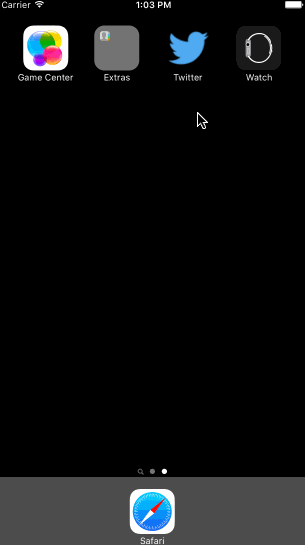

## CodePath Week 4: Twitter Contd.

This is the assignment for Week 4 of the [CodePath](http://www.codepath.com) iOS for Engineers class for Fall 2015, built with [Xcode 7.0](https://developer.apple.com/xcode/download/) and [Swift](https://developer.apple.com/swift/). 

It builds on top of Week 3's [basic Twitter client](https://github.com/xke/Twitter) to add sidebar menu functionality utilizing gesture recognition, and a profile page linked from the menu and from images in the main timeline.

The real Twitter app has thousands of other features, which we won't be delving into here. Also, more features does not necessarily make a product better, or easier to use. At times, it's the opposite. The difficult trick is to build features that yield the most impact for users, within an environment of non-infinite time and resources!

Time spent: 10 hours

#### Required Features

- [X] Hamburger menu
   - [X] Dragging anywhere in the view should reveal the menu.
   - [X] The menu should include links to your profile, the home timeline, and the mentions view.
   - [X] The menu can look similar to the LinkedIn menu or feel free to take liberty with the UI.
- [X] Profile page
   - [X] Contains the user header view
   - [X] Contains a section with the users basic stats: # tweets, # following, # followers
- [X] Home Timeline
   - [X] Tapping on a user image should bring up that user's profile page

### Walkthrough

Credits
---------
* [Twitter API](https://apps.twitter.com/)
* [Mathew Sanders' guide to transition animation in Swift](http://mathewsanders.com/interactive-transitions-in-swift/)
* [Implementation from lordchair for reference](https://github.com/lordchair/Codepath-Swift-Project-4/)
* [LiceCap for making the animated gif](http://www.cockos.com/licecap/)
